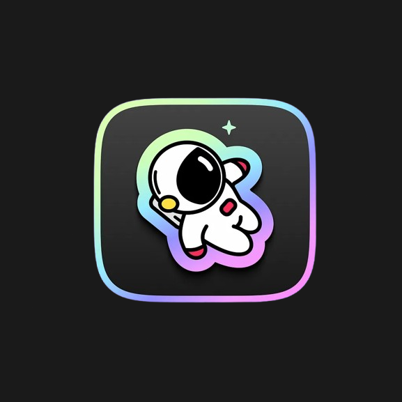

<p align="center">
  
</p>

# AstroDeck

<p>
  <a href="https://www.buymeacoffee.com/wolfskii">
    
  </a>
</p>

Your other screen, ready for anything. AstroDeck is a free, modern dashboard for time, music, and everyday apps, with built-in Spotify and YouTube Music support. Use a mouse or control it with your touchscreen. No extra hardware required.

## Apps

Open an app from the bar on the left. **Settings → Apps** turns any of them on or off. Settings itself stays in the bar.

| App | What you get |
| --- | --- |
| Home | Clock, today's date, local weather, and the track that is playing, with previous, play/pause, and next |
| Spotify | Now playing, playlists, likes, shuffle, volume, and seek |
| YouTube | YouTube Music search and playback, saved songs, and local playlists |
| System media | Whatever the computer is already playing |
| Teams | Meeting controls: reactions, mute, camera, share, raise hand, chat, and leave |
| VS Code | A workspace page aimed at VS Code and Cursor |
| Weather | A forecast for the same place shown on Home |
| Websites | Any site you add in Settings. It fills the window, with the sidebar still on top |

Some websites refuse to be shown inside another app and stay blank.

## Connections

| Connection | How it works |
| --- | --- |
| Spotify | Sign in from **Settings → Spotify**. The built-in sign-in plays through AstroDeck and needs Spotify Premium. A developer Client ID uses Spotify's Web API for likes, shuffle, and device volume. |
| YouTube Music | No Google sign-in. Playback uses a guest profile stored on this computer. Lyrics can fall back through LRCLIB, Musixmatch, Kugou, and NetEase, in the order you set. |
| System media | Reads the computer's now-playing session and controls play, skip, seek, and output volume. |
| Microsoft Teams | **Settings → Microsoft Teams** turns on the local Teams device API for reactions, chat, and meeting state. Mute, camera, share, raise hand, and leave use Teams keyboard shortcuts. Restart Teams after setup. |
| Weather | Home and the Weather app use [Open-Meteo](https://open-meteo.com/) for the computer's location, or a place you set under **Settings → Home**. |

The window can sit in the system tray. Closing it hides AstroDeck instead of quitting. From **Settings → General** you can start with the computer, start in the tray, or hide the Windows taskbar button while the window is open.

## Features

- **Sidebar** — Home, music, Teams, weather, websites you add, and Settings
- **Touch or mouse** — Large controls. Touch is optional
- **Plugin system** — Extra apps can still be added as JSON plugins
- **Windows, macOS, and Linux**

## Tech Stack

- **Frontend:** Svelte 5, TypeScript, Vite
- **Backend:** Tauri 2, Rust
- **System info:** sysinfo

## Quick Start

### Prerequisites

- Node.js 18+
- Rust toolchain
- Tauri CLI: `npm install -g @tauri-apps/cli`

### Setup

```bash
git clone https://github.com/Wolfskii/AstroDeck.git
cd AstroDeck
npm install
cp .env.example .env
npx tauri dev
```

Or using Taskfile (after copying `.env.example` to `.env`):

```bash
task install && task dev
```

## Releases (GitHub Actions)

Pushes and merges to **`develop`** and **`production`** trigger the [Release workflow](.github/workflows/release.yml).

| Branch | Version bump | GitHub release |
| --- | --- | --- |
| `develop` | Patch (`0.1.0` → `0.1.1`) | Pre-release (`v0.1.1-dev`) |
| `production` | Minor, patch reset (`0.1.x` → `0.2.0`) | Stable release (`v0.2.0`) |

Each run builds **Windows**, **Linux**, and **macOS** artifacts (installers + portable builds) and attaches them to the release with sorted commit notes.

### Version file

The canonical version lives in [`VERSION`](VERSION) (currently `0.1.0`). CI syncs it into `package.json`, `src-tauri/Cargo.toml`, and `src-tauri/tauri.conf.json`.

To **pin a specific version**, edit `VERSION` and commit it with your changes. If that commit changes `VERSION` to something other than the auto-bump result, the pipeline uses your value instead.

After a successful release, the workflow commits the resolved version back to the branch with `[skip ci]`.

## Packaging

AstroDeck can also build native production packages locally through the Taskfile or npm scripts.

### Default Host Build

Build for the current OS:

```bash
task deploy
```

This runs the packaging script in `scripts/package-app.mjs`. Local `task deploy` / `task deploy:windows` (and the other host package commands) bump the patch version with a numeric prerelease (for example `0.1.3` → `0.1.4-1`) before building, so each local installer shows a distinct version in Settings → Updates. MSI requires that prerelease identifier to be numeric (`-dev` is rejected). CI releases keep the GitHub versioning rules below.

It then builds the frontend, runs `tauri build`, and copies the resulting native bundle files into:

```text
.artifacts/<platform>/
```

The original native bundle output also remains in:

```text
src-tauri/target/release/bundle/
```

### Explicit Platform Tasks

```bash
task deploy:windows
task deploy:macos
task deploy:linux
```

Equivalent npm commands:

```bash
npm run package:app
npm run package:windows
npm run package:macos
npm run package:linux
```

### Platform Notes

- `task deploy` is the recommended default because it targets the current host OS automatically.
- Windows packaging works on Windows and produces native installers such as `.msi` and `.exe`.
- When the host OS is not Linux and you request a Linux build, the packaging script now tries to build inside Docker automatically. Docker must be installed and running.
- macOS packaging is not supported from Windows or Linux in this script. Docker is not a practical or supported way to produce real Tauri macOS `.app` / `.dmg` bundles because Apple tooling and signing are macOS-specific.

### Cross-Building From Windows

- `task deploy:linux` on Windows: supported through Docker, if Docker Desktop is installed and started.
- `task deploy:macos` on Windows: fails fast with a clear message telling you to use a real macOS machine or macOS CI runner.

## Project Structure

```
AstroDeck/
├── src/              # Svelte frontend (sidebar, Home, music, settings)
├── src-tauri/        # Rust backend (Spotify, YouTube Music, media, Teams, weather)
├── plugins/          # Built-in plugin folders and manifests
├── scripts/          # Packaging and helper scripts
├── docs/             # Documentation
└── ...
```

## Adding Plugins

Built-in apps live in `plugins/` as folders with a `plugin.json`:

- `clock` — Home
- `spotify`
- `youtubeMusic`
- `media` — system media
- `teams`
- `vscode`

A plugin folder needs:

- `id` — unique id, also the sidebar scene id
- `name` — display name
- `priority` — used when more than one app is detected
- `triggers` — optional process or window rules
- `view` — optional screen, such as `mediaPlayer`
- `layout` — button grid used when the app has no dedicated screen

User plugins in `~/AstroDeck/plugins/` override a built-in with the same `id`. See [Plugins](docs/plugins.md).

## Documentation

- [Architecture](docs/architecture.md)
- [Detectors](docs/detectors.md)
- [Layouts](docs/layouts.md)
- [Plugins](docs/plugins.md)
- [Actions](docs/actions.md)
- [Roadmap](docs/roadmap.md)

## License

MIT
