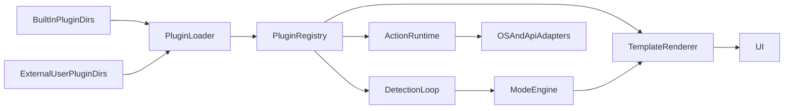

# AstroDeck Architecture

## Overview

AstroDeck is a context-aware control deck: a cross-platform desktop app that dynamically changes its UI based on which applications are running. Built with **Tauri 2** (Rust backend) and **Svelte 5** (TypeScript frontend).

## High-Level System Architecture

## Data Flow

1. The plugin engine loads built-in plugin folders and external user plugin folders.
2. Plugin-local assets are normalized and declarative `actionSpec` buttons are registered.
3. The detector loop builds a detection context from process names, executable names, and visible window titles.
4. The mode engine resolves the active scene by trigger match and priority.
5. The frontend renders either a generic grid scene or a template-driven scene such as `mediaPlayer`.
6. Button clicks route to either legacy string handlers or declarative plugin runtime actions.

## Directory Structure

| Path | Description |
|------|-------------|
| `src/` | Frontend: Svelte 5, Vite, TypeScript |
| `src-tauri/` | Backend: Rust, Tauri 2 |
| `plugins/` | Built-in plugin folders and legacy flat manifests |
| `~/AstroDeck/plugins/` | External user plugin folders loaded at runtime |

## Frontend Stack

- **Svelte 5** with runes (`$props`, `$state`, `$derived`)
- **Vite** for build and dev server
- **TypeScript** for type safety
- Components: `DeckGrid`, `DeckButton`, `MediaPlayerView`

## Backend Stack

- **Rust** with Tauri 2
- **sysinfo** for cross-platform process detection
- **serde** for JSON (de)serialization
- Modules: `detectors`, `mode_engine`, `layout_engine`, `plugin_engine`, `actions`

## State Management

- **AppState** (Rust): `Mutex`-wrapped `plugins`, `plugin_actions`, and `active_scene_id`
- **Frontend sync**: Tauri `scene-changed` event carries `SceneResponse` (active scene, layout, available scenes)
- Frontend subscribes via `app.listen()` and updates local state

## Plugins

- Plugin folders can contain `plugin.json` plus local assets
- Legacy flat JSON manifests are still accepted
- External plugins override built-ins on `id` collisions
- Each plugin defines: id, name, priority, triggers, layout, and optional `view` template metadata

## Browser Debug Panel

- `src-tauri/src/websocket.rs` exposes the log bus to the browser debug/settings panel
- It now also serves live plugin metadata in addition to logs and Spotify state
